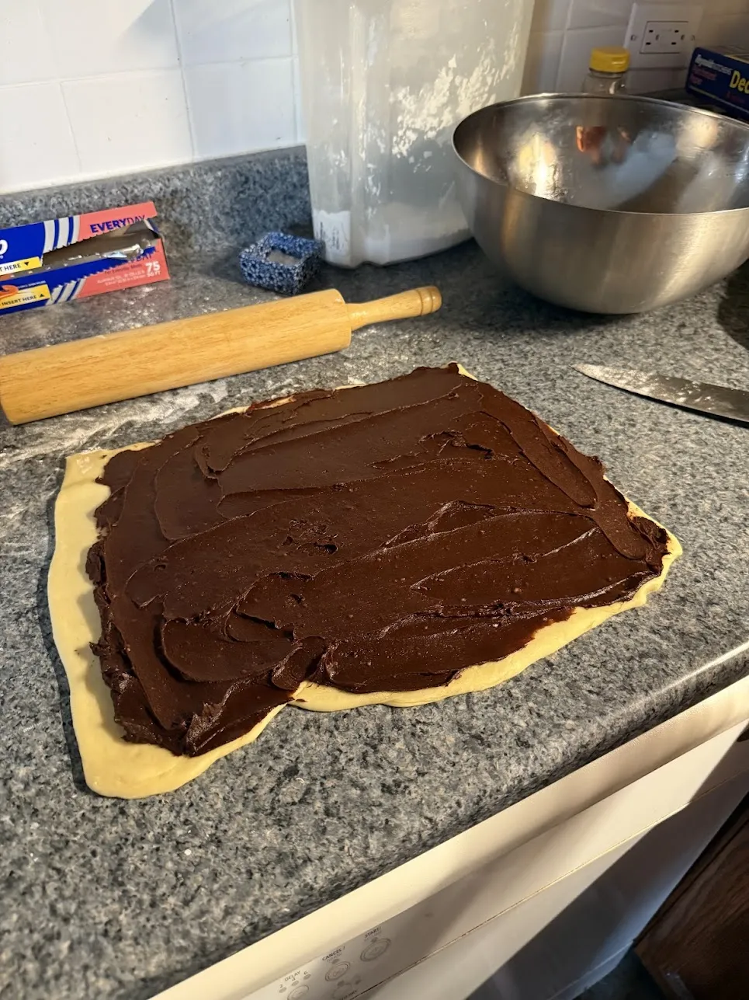
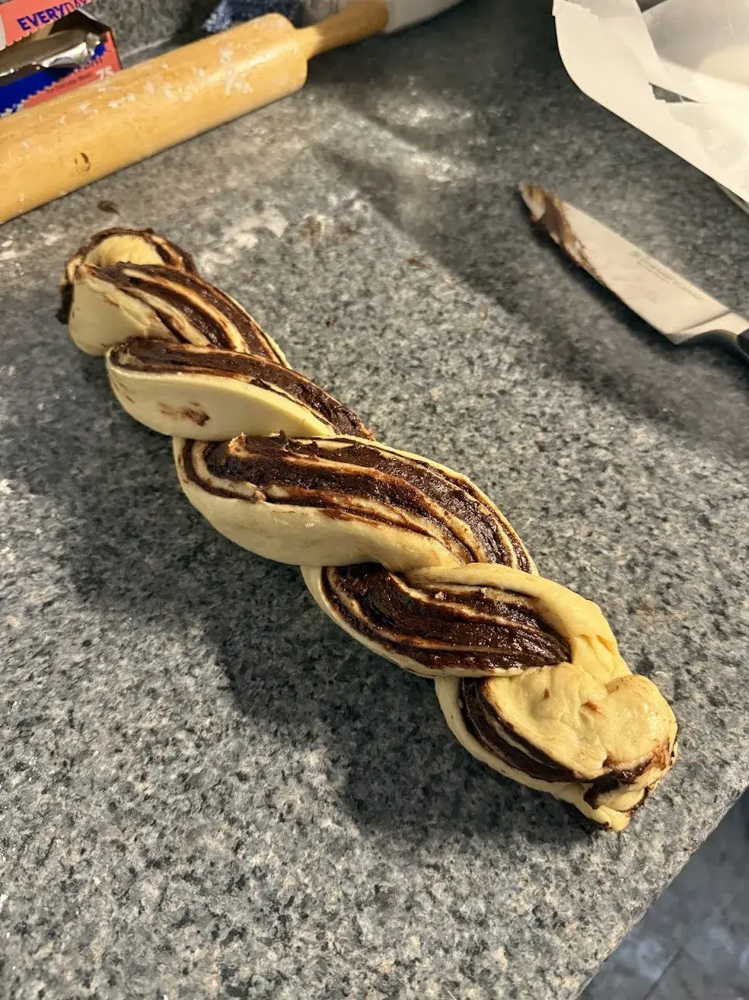
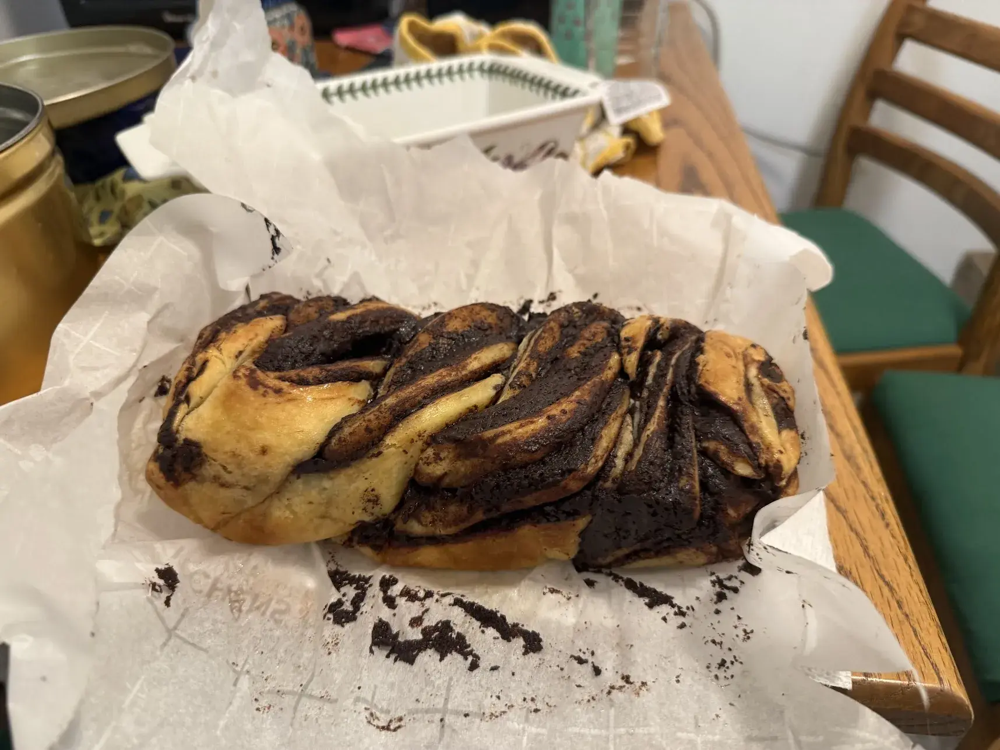

## life can be wonderful

my first time baking with Yeast and making a real dough that you have to "Proof" and let Rise and such! i don't love the whole concept of waiting until the Dough "doubles in size" (it seems so imprecise...), but everything worked out and i got a pretty nice-looking product in the end that i was Happy with!

it was fun to braid the dough and i thought the stripes of chocolate looked very pretty :)

i had to run and put it in the oven and take it out during one long session of Peak (that failed)...

